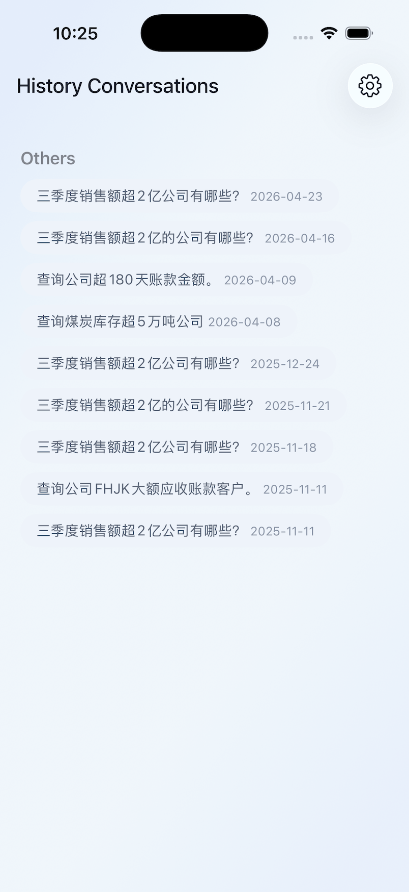
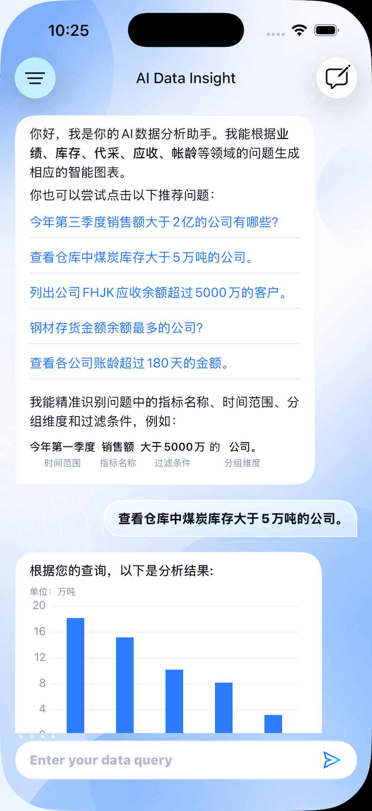

# AIDataInsight iOS

AIDataInsight iOS 是 AIDataInsight 多端学习项目中的 iOS 端实现。当前 iOS 端是最完整的参考端，使用 UIKit + Swift Package Manager 构建，已经实现登录、设置、隐私协议、AI Chat、历史会话、函数调用分析、图表展示、流式回复和会话反馈等核心功能。

项目的长期目标不是让其它端照抄 iOS 页面，而是从 iOS 的真实实现中提炼领域模型、UseCase、UI State、UI Layout 和 API 契约，再让 Android / Web 等端按契约生成。iOS 端因此既是可运行产品原型，也是跨端契约的重要参考实现。

## 当前能力

- 登录成功后进入 AI 业务主入口。
- AI Chat 支持模板问题、新会话、历史会话加载和自然语言提问。
- 函数调用链路支持 `FunctionName -> FunctionArguments -> /chart/{functionName}` 的动态参数分发。
- 图表链路支持柱状图、图例、单位判断和空图表兜底文案。
- 流式回复使用 SSE，并通过 `CADisplayLink` 做平滑渲染。
- History 支持分页加载、分组展示、删除单条、清空全部和选择历史会话回填 Chat。
- 设置页、隐私协议、账号会话和退出登录已接入模块化路由。
- 默认学习环境使用 Apifox mock host。

## 工程结构

```text
app-ios
├── AIDataInsight/                 # Xcode App 壳工程
├── AIDataInsight.xcodeproj        # iOS 工程
├── Dependencies/                  # 聚合本地 Swift Package 的依赖包
└── Packages/
    ├── library-basics/            # 基础设施：网络、账号、路由、环境、基础 UI
    ├── library-common/            # 通用业务模块：登录、隐私、设置、AppMain
    └── module-ai/                 # AI 数据分析业务模块
```

### App 壳工程

`AIDataInsight` 是很薄的壳工程，主要负责：

- `AppDelegate` / `SceneDelegate`
- Xcode scheme 与 xcconfig 环境
- AppIcon、LaunchScreen、Info.plist
- 通过 `Application.agent.frontModule("AppMain")` 启动模块化入口

真正的业务入口在 `Packages/library-common/Sources/AppMain`。`AppMain` 根据账号会话决定 root：

- 未登录：进入 `LoginProtocol`
- 已登录：进入 `ProtocolAI`

### library-basics

`library-basics` 提供基础设施能力：

- `Account` / `AccountProtocol`：账号会话、登录态、token 存储
- `AppLaunch`：模块注册与生命周期转发
- `AppSecurity`：安全相关基础能力
- `BaseEnv` / `Environment`：环境、target、baseURL、隐私协议地址
- `BaseKit` / `BaseUI`：通用工具、主题、基础 UI
- `BaseViewModel`：任务管理
- `Networking`：请求描述、统一响应、token 刷新、SSE、网络可达性
- `Router`：协议路由
- `Storage`：本地存储抽象

当前默认 mock baseURL 在：

```text
Packages/library-basics/Sources/Environment/AppEnvironmentValues.swift
```

### library-common

`library-common` 提供可复用业务模块和协议：

- `AppMain`：应用主入口模块，负责登录态切 root
- `CommonViewModel`：业务 ViewModel 的公共请求入口
- `Login` / `LoginProtocol`
- `Privacy` / `PrivacyProtocol`
- `Setting` / `SettingProtocol`
- `ProtocolAI`：AI 模块路由协议

### module-ai

`module-ai` 是当前核心业务模块，已经按跨端迁移目标整理为四层：

```text
ModuleAI
├── Domain/              # 领域模型与 Repository 协议
├── Application/         # UseCase 与 application output
├── Repositories/        # iOS 网络实现、DTO 适配、API descriptor
└── Presentation/        # UIKit 页面、ViewModel、ViewData、Cell、图表
```

关键目录：

- `Domain/AIChat`：`AIChatRepository`、`TemplateModel`、`FunctionName`、`FunctionArguments`、`FunctionModel`、`HistoryDetailModel`、`AIChatEndpoint`
- `Domain/History`：历史会话领域模型与 `HistoryRepository`
- `Application/UseCases/AIChat`：模板加载、历史详情、函数调用、图表数据、点赞反馈、流式回复
- `Application/UseCases/History`：历史分页、删除单条、清空全部
- `Repositories/AIChat`：`ChatApi`、`ChartApi`、`DefaultAIChatRepository`、`FunctionResponseDTO`
- `Repositories/History`：`HistoryApi`、`DefaultHistoryRepository`
- `Presentation/App`：`ContainerViewController` 与 `ModuleAIRouter`
- `Presentation/AIChat`：聊天页面、ViewModel、消息 Cell、输入区、欢迎问题、图表 Cell
- `Presentation/History`：历史面板、菜单、历史列表 Cell
- `Presentation/Shared/Charts`：图表数据、渲染器、marker、formatter

## AI 业务主入口

登录成功后，`AppMain` 通过 `ProtocolAI` 路由到 `ModuleAIRouter`，再进入 `ContainerViewController`。

`ContainerViewController` 当前使用 UIKit 子控制器组织 AI 主入口：

- 主内容：`AIChatViewController`
- 历史面板：`HistoryViewController`
- 容器手势：横向拖拽打开 / 关闭 History
- 选择历史：关闭 History，并命令 Chat 在原位加载该会话
- 打开 History：刷新历史列表，但不销毁 Chat 状态

这套实现已经被抽象进跨端契约。后续 Android / Web 不应该照抄 UIKit child-controller 或 transform 细节，只需要实现“主 Chat + History 辅助面板 + 状态保持”的领域语义。

## AI Chat 主链路

### 模板问题

```text
AIChatViewModel
-> LoadTemplateUseCase
-> AIChatRepository.loadTemplate
-> DefaultAIChatRepository
-> ChatApi.template
-> TemplateModel
```

当前 Apifox mock 的 `/chat/template` 可能把 `data` 返回为内嵌 JSON 字符串。iOS 端在 Repository 中先拿到字符串，再解码为 `TemplateModel`。跨端契约要求所有端最终只向上返回 `TemplateQuestionSet / TemplateModel`，不能把接口字符串泄漏给 UI。

### 函数调用与图表

```text
用户输入
-> AIChatViewModel.sendFunctionMessage
-> SendFunctionMessageUseCase
-> ChatApi.function
-> FunctionResponseDTO.toDomainModel()
-> FunctionName + FunctionArguments
-> LoadChartDataUseCase
-> ChartApi.chart
-> HistoryDetailModel
-> AIChatChartBuilder
-> AIChatChartCell / AIChatLegendChartCell
```

动态参数主链路固定为：

```text
FunctionName -> FunctionArguments kind -> /chart/{FunctionName.rawValue} -> ChartPayload
```

这条链路已经写入跨端契约，后续端侧实现应从契约生成，不从 iOS Cell 或图表 View 反推。

### 流式回复

```text
用户输入
-> StreamAIResponseUseCase
-> AIChatRepository.streamMessage
-> DefaultAIChatRepository
-> ChatApi.stream
-> CommonRequester.requestSSE
-> SSEClient
-> AIChatViewModel 流式状态
-> AIChatCell 增量渲染
```

`ChatApi.stream` 使用 `AIChatEndpoint.streamPath`，由网络层和环境配置组合完整 URL。Repository 不直接引入底层 Networking 配置，也不硬编码完整流式 URL。

流式渲染不是每收到一个 chunk 就立即刷新 UI，而是：

- 网络层快速接收 SSE `data:` 事件。
- ViewModel 累积待渲染文本。
- `CADisplayLink` 以更平滑的节奏推进显示。
- 中文按字推进，英文尽量按单词边界推进。

## History 主链路

```text
HistoryViewController
-> HistoryViewModel
-> LoadHistoryPageUseCase / DeleteHistoryUseCase / DeleteAllHistoryUseCase
-> HistoryRepository
-> DefaultHistoryRepository
-> HistoryApi
-> HistoryListViewDataBuilder
-> HistoryCell
```

History 是 AI Home 的辅助面板，不是新的根页面。打开面板时可以刷新列表；选择历史会话后，由 Chat 在当前页面加载会话详情。

## 网络与环境

iOS 网络层位于：

```text
Packages/library-basics/Sources/Networking
```

当前网络设计包括：

- `RequestDescriptor`：子模块 API descriptor
- `NetworkClient` / `NetworkExecutor`：请求执行
- `ResponseModel`：统一响应外壳
- `TokenRefreshCoordinator`：token 刷新协调
- `SSEClient`：SSE 流式响应
- `NetworkReachabilityAdapter`：网络可达性

模块内 API path 必须写在对应 API descriptor 中，例如：

- `ChatApi`
- `ChartApi`
- `HistoryApi`

不要在 Repository 或 ViewModel 中拼完整 URL。

## 跨端契约关系

仓库根目录的 `docs/cross-platform` 是多端契约包。iOS 端当前承担“参考实现”和“验真来源”的角色，但跨端生成时以契约包为准。

相关文档：

- `../docs/ai-generation-guide.md`
- `../docs/cross-platform/contracts/README.md`
- `../docs/cross-platform/contracts/domain/ai-chat.schema.json`
- `../docs/cross-platform/contracts/usecases/ai-chat.usecases.yaml`
- `../docs/cross-platform/contracts/ui-state/ai-chat-state.yaml`
- `../docs/cross-platform/contracts/ui-layout/ai-home-layout.yaml`
- `../docs/cross-platform/api-contract.md`

当 iOS 实现中发现新的跨端事实时，应先更新契约，再同步其它端。

## 技术栈

- Swift 5.6
- UIKit
- Swift Package Manager
- iOS 15+
- MVVM + UseCase
- URLSession
- Server-Sent Events
- DGCharts 5.1.0
- SwifterSwift
- SVProgressHUD

## 运行方式

1. 用 Xcode 打开：

```text
app-ios/AIDataInsight.xcodeproj
```

2. 选择 scheme：

```text
AIDataInsight
AIDataInsight.DEV
AIDataInsight.PRE
```

3. 选择 iPhone / iPad 模拟器运行。

当前项目以 mock 数据和学习环境为主，默认 baseURL 指向：

```text
https://m1.apifoxmock.com/m1/3174267-1700689-default
```

## 测试

`module-ai` 已有较完整的单元测试，覆盖：

- AIChat 模板加载
- 函数调用 DTO 映射
- 动态函数参数 schema
- 图表数据加载
- 历史详情加载
- 流式回复
- 点赞反馈
- History 分页、删除、清空
- History ViewData builder

可在 Xcode 中运行 `ModuleAITests`，也可以使用 SwiftPM 测试单个 package。

## Demo

 

## 说明

- 当前 iOS 端是学习项目和跨端契约参考端，不是生产后端接入版本。
- UIKit 仍是当前主实现，未来可逐步评估 SwiftUI / macOS 原生化。
- iPadOS 兼容模式下可在 macOS 上运行；未来如果迁移 SwiftUI，可进一步增强 macOS 原生体验。
